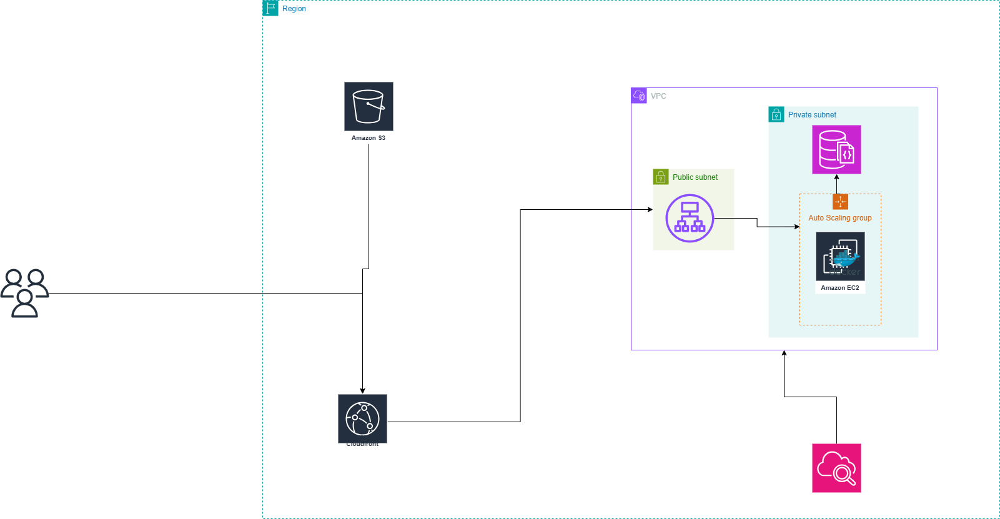

# Dockerized Fullstack Todo List Application

This project is a fullstack todo list application that has been dockerized using Docker and Docker Compose. The application consists of a Node.js backend, a React frontend, and a MongoDB database.

## Project Structure

- **Backend**: Node.js application with Express and Mongoose.
- **Frontend**: React application built with Vite.
- **Database**: MongoDB for data storage.
- **Mongo Express**: Web-based MongoDB admin interface.

## Docker Setup

### Dockerfiles

- **Backend**:

  - `Backend/Dockerfile.dev`: For development, uses `npm run dev`.
  - `Backend/Dockerfile.prod`: For production, uses `npm start`.

- **Frontend**:
  - `Frontend/Dockerfile.dev`: For development, uses `npm run dev`.
  - `Frontend/Dockerfile.prod`: For production, builds the app and serves it using Nginx.

### Docker Compose

- **Development**: `docker-compose.dev.yml`

  - Builds and runs the backend and frontend in development mode.
  - Exposes ports 3000 (backend) and 5173 (frontend).

- **Production**: `docker-compose.prod.yml`
  - Pulls images from Docker Hub.
  - Includes MongoDB and Mongo Express.
  - Exposes ports 3000 (backend), 80 (frontend), 27017 (MongoDB), and 8081 (Mongo Express).

## Docker Commands

### Creating Docker Images

#### Development

To create a Docker image for the backend in development mode, run the following command from the project root:

```bash
docker build -t your-dockerhub-username/backend:dev -f Backend/Dockerfile.dev ./Backend
```

To create a Docker image for the frontend in development mode, run:

```bash
docker build -t your-dockerhub-username/frontend:dev -f Frontend/Dockerfile.dev ./Frontend
```

#### Production

To create a Docker image for the backend in production mode, run:

```bash
docker build -t your-dockerhub-username/backend:prod -f Backend/Dockerfile.prod ./Backend
```

To create a Docker image for the frontend in production mode, run:

```bash
docker build -t your-dockerhub-username/frontend:prod -f Frontend/Dockerfile.prod ./Frontend
```

### Pushing Production Images to Docker Hub

To push the production images to Docker Hub, run the following commands:

```bash
docker push your-dockerhub-username/backend:prod
docker push your-dockerhub-username/frontend:prod
```

Make sure to replace `your-dockerhub-username` with your actual Docker Hub username.

## How to Run

### Development

1. Navigate to the project root directory.
2. Run the following command to start the development environment:
   ```bash
   docker-compose -f docker-compose.dev.yml up
   ```

### Production

1. Navigate to the project root directory.
2. Run the following command to start the production environment:
   ```bash
   docker-compose -f docker-compose.prod.yml up
   ```

## Accessing the Application

- **Backend**: http://localhost:3000
- **Frontend**: http://localhost:80 (production) or http://localhost:5173 (development)
- **Mongo Express**: http://localhost:8081

## Additional Notes

- Ensure Docker and Docker Compose are installed on your system.
- Replace `your-dockerhub-username` in the `docker-compose.prod.yml` file with your actual Docker Hub username if you are using custom images.

## Testing the Containers

To test the running containers, you can use the `test_containers.sh` script. This script checks the status of the frontend, backend, MongoDB, and Mongo Express.

### Running the Test Script

1. Make the script executable:

   ```bash
   chmod +x test_containers.sh
   ```

2. Run the script:
   ```bash
   ./test_containers.sh
   ```

This will output the status of each service, allowing you to verify that everything is running correctly.

## Environmental Variables

The application uses the following environmental variables, which should be defined in a `.env` file in the project root:

- `MONGO_DB`: The the db for the MongoDB database.

Example `.env` file:

## Migrating to AWS

This section outlines the steps to migrate the Dockerized application to AWS, utilizing various AWS services for scalability, security, and performance.

## Architectural Diagram




This diagram will illustrate the flow of data and the interaction between different AWS services used in the project.

### AWS Services Used

- **CloudFront**: For content delivery and caching.
- **S3**: For storing static assets and frontend build files.
- **Application Load Balancer (ALB)**: For distributing incoming traffic to EC2 instances.
- **EC2 Auto Scaling Group**: For automatically scaling the number of EC2 instances based on demand.
- **VPC**: For creating a virtual network to isolate resources.
- **Public and Private Subnets**: For segregating public-facing and internal resources.
- **Security Groups**: For controlling inbound and outbound traffic to EC2 instances.
- **AWS DocumentDB**: For managed MongoDB-compatible database service.

### Steps to Migrate

1. **Set Up VPC**:

   - Create a VPC with public and private subnets.
   - Configure route tables and internet gateways.

2. **Launch EC2 Instances**:

   - Launch EC2 instances in the private subnet.
   - Use an Auto Scaling Group to manage the number of instances.

3. **Configure Application Load Balancer**:

   - Set up an ALB to distribute traffic to the EC2 instances.
   - Configure health checks and target groups.

4. **Deploy Frontend to S3**:

   - Build the frontend application and upload the static files to an S3 bucket.
   - Configure the S3 bucket for static website hosting.

5. **Set Up CloudFront**:

   - Create a CloudFront distribution pointing to the S3 bucket.
   - Configure caching and SSL/TLS settings.

6. **Migrate Database to DocumentDB**:

   - Set up an AWS DocumentDB cluster.
   - Update the backend application to connect to DocumentDB.

7. **Configure Security Groups**:

   - Set up security groups to allow traffic between the ALB, EC2 instances, and DocumentDB.

8. **Monitor and Scale**:
   - Use AWS CloudWatch to monitor the application and set up alarms.
   - Adjust the Auto Scaling Group settings based on performance metrics.

### Additional Resources

- [AWS Documentation](https://docs.aws.amazon.com/)
- [AWS CloudFormation](https://aws.amazon.com/cloudformation/) for infrastructure as code.

